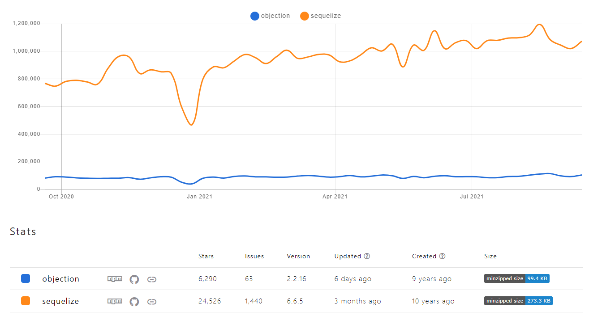

# ORM research for TypeScript Node.js applications

## Table of contents

- [Introduction](#introduction)
  - [Important concepts](#important-concepts)
  - [Which libraries are we going to analyze?](#which-libraries-are-we-going-to-analize)
- [Case study](#case-study)
  - [Database schema](#database-schema)
  - [Endpoints](#endpoints)
- [Results](#results)
  - [Community](#community)
  - [Documentation](#documentation)
  - [TypeScript integration](#typescript-integration)
  - [Performance](#performance)
- [Developing](#developing)
  - [Database configuration](#database-configuration)
  - [Migrations](#migrations)
  - [Starting app](#starting-app)
  - [Debugging](#debugging)
- [License](#license)

## Case study

### Libraries

- [Sequelize](https://sequelize.org/): It features solid transaction support, relations, eager and lazy loading, read replication and more. It is one of the most complete ORMs for Node.js. It has support for Postgres, MySQL, MariaDB, SQLite and Microsoft SQL Server.

- [Objection](https://vincit.github.io/objection.js/): It's build on Knex, thus supports the same databases. It has all the benefits of an SQL query builder but also a powerful set of tools for working with relations, for this it can be considered an ORM.

### Database schema

For research purposes, we had to define a database schema. We wanted to keep it simple but also explore models relations API of each library. For that reason we decided to implement a simple ManyToMany relation. We used [Postgres](https://www.postgresql.org/) as database engine.

Above you can see database schema graph and its definition.


```
Table orders {
  id int [pk]
  user string
  date timestamp
}

Table items {
  id int [pk]
  name string
  value float
}

Table order_items {
  order_id int [ref: > orders.id]
  item_id int [ref: > items.id]
}

```

### Implementation

In order to have where implement our study libraries we developed a simple [Express.js](https://expressjs.com/) application with two endpoints. Main idea is to contrast how these libraries behave in most common use cases, check performance, compare implementation complexity, etc.

```
# ⬇️ Get all orders
#
# If query string 'simple' is set to "true", then app will return
# just the records from "orders" table. Otherwise, we are going to
# receive orders array with its nested relations.
GET /<orm_name>/orders?simple=<boolean>

# ⬆️ Create orders
#
# This endpoint receives an array of orders and create them.
# Orders could include nested relations, in that cases app should
# hanlde it and create them too.
POST /<orm_name>/orders # Create many orders with their items
```

The key on this implementation is that we are managing nested resources: an order has one or many items. Payloads we receive has orders and its nested items, and we have to handle them.

After all this setup we are finally ready to implement our libraries and start having some results.

## Results

### Community

First, we can look at NPM packages and their metrics to have a clear image about how much they are being used.

<table width="100%" align="center">
  <tr>
    <th>Library</th>
    <th>Creation date</th> 
    <th>Weekly downloads</th> 
    <th>Dependents</th> 
  </tr>
  <tr align="center">
    <td>
      <a link="https://www.npmjs.com/package/sequelize" target="blank">Sequelize</a>
    </td>
    <td>Jul 22, 2010</td>
    <td>1,068,529</td>
    <td>4722</td>
  </tr>
  <tr align="center">
    <td>
      <a link="https://www.npmjs.com/package/objection" target="blank">Objection</a>
    </td>
    <td>Apr 14, 2015</td>
    <td>104,995</td>
    <td>377</td>
  </tr>
</table>

<p align="left">
  
</p>

With this information, we can take some assumptions. First of all, clearly Sequelize is the most used library. It has been in the game for the longest time and its community haven’t stopped growth.

It’s interesting to see that Knex is almost as used as Sequelize despite being a less friendly solution. Besides both packages duplicated their weekly downloads this year. Objection, on the other hand, shows practically an almost null increase in their weekly downloads, keeping it around 50K downloads per week.

Finally, in the last year TypeORM has triplicated its downloads. Despite staying still well below Sequelize and Knex it seems to be positioning itself as an interesting competitor.

**You can find an updated analisys about npm packages on [NPM Trends](https://www.npmtrends.com/knex-vs-sequelize-vs-objection-vs-typeorm) 🔗**.

### Documentation

Documentation is a really important element when you have to choose a library. On this depends how much easy or painful could be to implement it.
For that reason, we analysed the next points:

- **Implementation**: Provides a "Getting started" guide, with examples and steps explanations about how to implement the library in my project.
- **Recipes**: Provides examples about how to implement solutions for different case uses (ie: relations).
- **Real-world examples**: Provides real-world examples, with implementations in differents frameworks.
- **Straightforward**: Easy to find needed information and read, updated and clear.
- **TypeScript implementation**: Provides documentation about TypeScript support, with examples and explanations about best practices.

<table width="100%" align="center">
  <tr>
    <th>Library</th>
    <th>Implementation</th> 
    <th>Recipes</th> 
    <th>Real-world examples</th>
    <th>Straightforward</th>
    <th>TypeScript</th>
  </tr>
  <tr align="center">
    <td>
      <a link="https://sequelize.org/v5/manual/getting-started.html" target="blank">Sequelize</a>
    </td>
    <td>✅</td>
    <td>✅</td>
    <td>❌</td>
    <td>❌</td>
    <td>⚠️</td>
  </tr>
  <tr align="center">
    <td>
      <a link="https://vincit.github.io/objection.js/guide/" target="blank">Objection</a>
    </td>
    <td>✅</td>
    <td>✅</td>
    <td>✅</td>
    <td>✅</td>
    <td>✅</td>
  </tr>
</table>

Given all these libraries are used for thousands of people around the globe everyday is not strange that they document the basics on how to implement and start using they. But, for an advanced use, we need more information.

Based in our research TypeORM and Objection are the best-documented ORMs. Both has an easy to understand, straightforward and user-friendly documentation, they provide real-world examples and recipes for the most common use cases. Besides, they both provide information about TypeScript support, with examples and best practices.

Either Sequelize and Knex provide TypeScript documentation, it is not enough to implement a clean solution in our projects and requires more research.

Knex documentation is not bad, but it lacks in official recipes or real-world examples.

Although Sequelize has a very large documentation, it is difficult to find something in there specially for edge cases.

### TypeScript integration

In the section above, we talk about TypeScript documentation these libraries provide

All analyzed libraries expose their own types we can use, but not all has a great integration with TypeScript and developing experience could be a little bit rough with some of them.

#### Sequelize 👎

Quoting its [own documentation](https://sequelize.org/master/manual/typescript.html): _"As Sequelize heavily relies on runtime property assignments, TypeScript won't be very useful out of the box. A decent amount of manual type declarations are needed to make models workable."_. Working with Sequelize and TypeScript could be a really bad experience when you are starting with typing in JavaScript. You have to do a lot of manual work to define your models types and made them work in strict mode.

Relationships are hard with Sequelize and TypeScript. You’ll need to add a set of mixin functions for every single [association](https://sequelize.org/master/manual/associations.html) you create and on both the models involved in the association. If you want to know more about this, you can read [this article which explains how to setup Sequelize with TypeScript](https://vivacitylabs.com/setup-typescript-sequelize/).

Moreover, when you start deep inside sequelize functionality you will notice many optional properties you can pass some functions are not typed! For example, when you use `bulkCreate` optional property `include` (which should be defined on `BulkCreateOptions` interface) is not created so you have to extend Sequelize type definitions yourself in order to use it.

#### Objection 🏆

**Integration with TypeScript is surprisingly simple and intuitive**. You define your models and Objection automatically generates all structure you need to use them. Models definition are very clean and use them is very straightforward.

Documentation is very simple and useful and you have [real-world examples as guide](https://github.com/Vincit/objection.js/blob/master/examples/express-ts/).

Besides, it could be a good alternative if you want to avoid using TypeORM decorators syntax, and keep a more conservative sintax.

### Performance

Probably one of the most controversial topics around ORMs is their performance, thus before start let me do a little disclaimer. This research doesn’t intent to convince you, or not, to use an ORM in your project, there are already a bunch of publications that talk about that. We are going to focus on just in a comparison between our selected libraries uses the use cases we presented before. That said, let's start.

To perform load tests against our application we used [autocannon](https://github.com/mcollina/autocannon). It is a fast HTTP/1.1 benchmarking tool written in Node.js. All tests were benchmarked using these options:

```bash
# Load script for GET (simple)
autocannon "localhost:8080/<orm>/orders?simple=true" \
  -m "GET" \
  -c 100 -d 20

# Load script for GET (nested)
autocannon "localhost:8080/<orm>/orders" \
  -m "GET" \
  -c 100 -d 20

# Load script for POST
autocannon "localhost:8080/<orm>/orders" \
  -m "POST" \
  -c 100 -d 20 \
  -i "./data.json" \
  -H "Content-Type: application/json"

# where <orm> = sequelize|objection
```

- `-c` The number of concurrent connections to use.
- `-d` The number of pipelined requests to use.
- `-m` The method of the requests.
- `-i` File path for request body.
- `-H` Headers definitions.

Test Bench Configuration:

- **OS**: Windows 10 Pro
- **CPU**: 3.80GHz AMD Ryzen 5 3600x
- **RAM**: 32 GB 3200MHz DDR4
- **Node version**: v14.16.1
- **MySQL Version**: v8.0.20

#### GET simple

<table>
  <tr>
    <th>Library</th>
    <th>Latency avg</th>
    <th>Latency max</th>
    <th>Req/Sec avg</th>
    <th>Req/Sec min</th>
    <th>Bytes/Sec avg</th>
    <th>Bytes/Sec min</th>
    <th>Total</th>
  </tr>
  <tr align="center">
    <td>
      <a>Sequelize</a>
    </td>
    <td>5115.2 ms</td>
    <td>6057 ms</td>
    <td>16.86</td>
    <td>14</td>
    <td>6.31 MB</td>
    <td>5.25 MB</td>
    <td>437 requests in 20.19s, 126 MB read</td>
  </tr>
  <tr align="center">
    <td>
      <a>Objection</a>
    </td>
    <td>2185.98 ms</td>
    <td>2483 ms</td>
    <td>43.35</td>
    <td>36</td>
    <td>11.7 MB</td>
    <td>9.72 MB</td>
    <td>967 requests in 20.16s, 234 MB read</td>
  </tr>
</table>

#### GET nested object

<table>
  <tr>
    <th>Library</th>
    <th>Latency avg</th>
    <th>Latency max</th>
    <th>Req/Sec avg</th>
    <th>Req/Sec min</th>
    <th>Bytes/Sec avg</th>
    <th>Bytes/Sec min</th>
    <th>Total</th>
  </tr>
  <tr align="center">
    <td>
      <a>Sequelize</a>
    </td>
    <td>8573.97 ms</td>
    <td>10817 ms</td>
    <td>1.5</td>
    <td>2</td>
    <td>1.44 MB</td>
    <td>1.91 MB</td>
    <td>300 requests in 20.91s, 28.7 MB read<br>
170 errors (170 timeouts)</td>
  </tr>
  <tr align="center">
    <td>
      <a>Objection</a>
    </td>
    <td>3402.75 ms</td>
    <td>4029 ms</td>
    <td>26.85</td>
    <td>20</td>
    <td>13.2 MB</td>
    <td>9.87 MB</td>
    <td>637 requests in 20.16s, 265 MB read</td>
  </tr>
</table>

#### POST nested object

<table>
  <tr>
    <th>Library</th>
    <th>Latency avg</th>
    <th>Latency max</th>
    <th>Req/Sec avg</th>
    <th>Req/Sec min</th>
    <th>Bytes/Sec avg</th>
    <th>Bytes/Sec min</th>
    <th>Total</th>
  </tr>
  <tr align="center">
    <td>
      <a>Sequelize</a>
    </td>
    <td>365.59 ms</td>
    <td>699 ms</td>
    <td>271.15</td>
    <td>173</td>
    <td>101 kB</td>
    <td>64.4 kB</td>
    <td>6k requests in 20.07s, 2.03 MB read</td>
  </tr>
  <tr align="center">
    <td>
      <a>Objection</a>
    </td>
    <td>510.28 ms</td>
    <td>797 ms</td>
    <td>194.2</td>
    <td>131</td>
    <td>65.9 kB</td>
    <td>44.1 kB</td>
    <td>4k requests in 20.12s, 1.32 MB read</td>
  </tr>
</table>

## Developing

### Database configuration

Before running the app, make sure you have MySQL

You need to create project database manually, to create it run the following steps inside a mysql terminal:

1. `CREATE DATABASE db_project_name;`

Don't forget to create a dotenv file for environment variables. `Dotenv` is used for managing environment variables. They must be stored in a `/.env` file. File structure is described below:

```
DB_HOST=localhost
DB_PORT=5432
DB_USERNAME=project_name
DB_PASSWORD=project_name
DB_NAME=db_project_name
```

### Migrations

You need to run migrations before start app. To do it simply run `npm run migrate`.

### Starting app

Run in your terminal: `npm start`.

## License

This project is written and maintained by [Emanuel Casco](https://github.com/emanuelcasco) and is available under the MIT [license](LICENSE.md).

    Copyright (c) 2019 Emanuel Casco

    Permission is hereby granted, free of charge, to any person obtaining a copy
    of this software and associated documentation files (the "Software"), to deal
    in the Software without restriction, including without limitation the rights
    to use, copy, modify, merge, publish, distribute, sublicense, and/or sell
    copies of the Software, and to permit persons to whom the Software is
    furnished to do so, subject to the following conditions:

    The above copyright notice and this permission notice shall be included in
    all copies or substantial portions of the Software.

    THE SOFTWARE IS PROVIDED "AS IS", WITHOUT WARRANTY OF ANY KIND, EXPRESS OR
    IMPLIED, INCLUDING BUT NOT LIMITED TO THE WARRANTIES OF MERCHANTABILITY,
    FITNESS FOR A PARTICULAR PURPOSE AND NONINFRINGEMENT. IN NO EVENT SHALL THE
    AUTHORS OR COPYRIGHT HOLDERS BE LIABLE FOR ANY CLAIM, DAMAGES OR OTHER
    LIABILITY, WHETHER IN AN ACTION OF CONTRACT, TORT OR OTHERWISE, ARISING FROM,
    OUT OF OR IN CONNECTION WITH THE SOFTWARE OR THE USE OR OTHER DEALINGS IN
    THE SOFTWARE.
